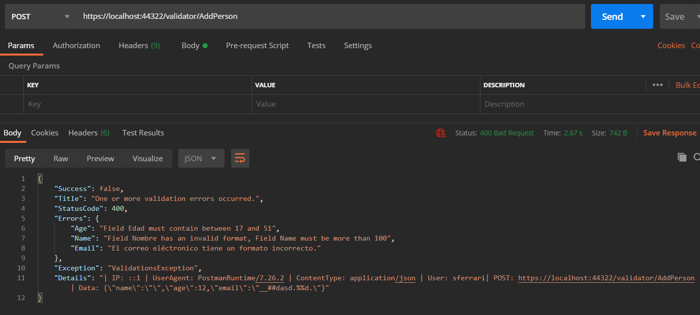
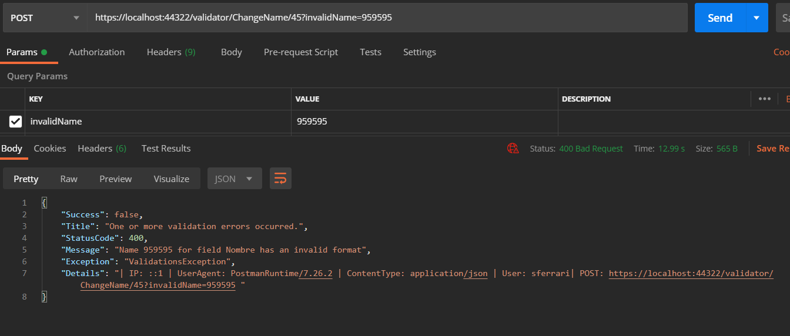

#  Kitpymes.Core.Validations

**Validaciones para multiples proveedores**

[](https://github.com/kitpymes/template-netcore-validations/actions)
[](https://www.nuget.org/packages/Kitpymes.Core.Validations/)
[](https://www.nuget.org/stats/packages/Kitpymes.Core.Validations?groupby=Version)
[](https://github.com/kitpymes/template-netcore-validations/blob/master/docs/LICENSE.txt)
[](https://github.com/kitpymes/template-netcore-validations/)
[](https://github.com/kitpymes/template-netcore-validations/)

## 📋 Requerimientos 

* Visual Studio >= 2019 (v16.3)

* NET TargetFramework >= netcoreapp3.0

* Net Core SDK >= 3.0.100

* C# >= 8.0

* Conocimientos sobre Inyección de Dependencias

## 🔧 Instalación 

_Se puede instalar usando el administrador de paquetes Nuget o CLI dotnet._

_Nuget_

```
Install-Package Kitpymes.Core.Validations
```

_CLI dotnet_

```
dotnet add package Kitpymes.Core.Validations
```

## ⌨️ Código

```cs
public class ValidationsException : Exception
{
    public ValidationsException(params string[] messages) {}

    public ValidationsException(IDictionary<string, string> messages) {}

    public int? Count { get; }

    public bool Contains(string message) {}
}
```

### Validator

```cs
public static class Validator
{
    public static ValidatorRule AddRule(object? value, Action<ValidatorRuleOptions> options) {}

    public static ValidatorRule AddRule(Func<bool> condition, string message) {}
}
```

```cs
public class ValidatorRule
{
    public bool IsValid { get; }

    public static void Add(Func<string> rule)  {}

    public ValidatorRule StopFirstError(bool stopFirstError = true) {}

    public ValidatorRule AddRule(object? value, Action<ValidatorRuleOptions> options) {}

    public ValidatorRule AddRule(Func<bool> condition, string message) {}

    public void Throw() {}

    public async Task ThrowAsync() {}
}
```

```cs
public class ValidatorRuleOptions
{
    public ValidatorRuleOptions IsNullOrAny(string? overrideRureFieldName = null) {}

    public ValidatorRuleOptions IsNullOrAnyWithMessage(string message) {}

    public ValidatorRuleOptions IsEqual(IEnumerable? valueCompare, (string fieldName, string fieldNameCompare)? fieldsName = null) {}

    public ValidatorRuleOptions IsEqualWithMessage(IEnumerable? valueCompare, string message) {}

    public ValidatorRuleOptions IsGreater(long max, string? overrideRureFieldName = null) {}

    public ValidatorRuleOptions IsGreaterWithMessage(long max, string message) {}

    public ValidatorRuleOptions IsLess(long min, string? overrideRureFieldName = null) {}

    public ValidatorRuleOptions IsLessWithMessage(long min, string message) {}

    public ValidatorRuleOptions IsNullOrEmpty(string? overrideRureFieldName = null) {}

    public ValidatorRuleOptions IsNullOrEmptyWithMessage(string message) {}

    public ValidatorRuleOptions IsRange(long min, long max, string? overrideRureFieldName = null) {}

    public ValidatorRuleOptions IsRangeWithMessage(long min, long max, string message) {}

    public ValidatorRuleOptions IsRegex(string regex, string? overrideRureFieldName = null) {}

    public ValidatorRuleOptions IsRegexWithMessage(string regex, string message) {}

    public ValidatorRuleOptions IsDirectory(string? overrideRureFieldName = null) {}

    public ValidatorRuleOptions IsDirectoryWithMessage(string message) {}

    public ValidatorRuleOptions IsEmail(string? overrideRureFieldName = null) {}

    public ValidatorRuleOptions IsEmailWithMessage(string message) {}

    public ValidatorRuleOptions IsFileExtension(string? overrideRureFieldName = null) {}

    public ValidatorRuleOptions IsFileExtensionWithMessage(string message) {}

    public ValidatorRuleOptions IsFile(string? overrideRureFieldName = null) {}

    public ValidatorRuleOptions IsFileWithMessage(string message) {}

    public ValidatorRuleOptions IsName(string? overrideRureFieldName = null) {}

    public ValidatorRuleOptions IsNameWithMessage(string message) {}

    public ValidatorRuleOptions IsPassword(long min, string? overrideRureFieldName = null) {}

    public ValidatorRuleOptions IsPasswordWithMessage(long min, string message) {}

    public ValidatorRuleOptions IsSubdomain(string? overrideRureFieldName = null) {}

    public ValidatorRuleOptions IsSubdomainWithMessage(string message) {}
}
```

**Ejemplo**

```cs
using Kitpymes.Core.Validations;
using System;

public class Person
{
    public Person(int age, string name, string email)
    {
        Validator
            .AddRule(age, x => x.IsLess(17).IsGreater(51).WithRuleFieldName("Edad"))
            .AddRule(name, x => x.IsName("Nombre"))
            .AddRule(email, x => x.IsEmailWithMessage("El correo eléctronico tiene un formato incorrecto."))
            .Throw();

        Id = Guid.NewGuid();
        Age = age;
        Name = name;
        Email = email;
    }

    public Person ChangeName(string name)
    {
        Validator.AddRule(name, x => x.IsName("Nombre")).Throw();

        Name = name;

        return this;
    }

    public Guid Id { get; private set; }
    public int Age { get; private set; }
    public string? Name { get; private set; }
    public string? Email { get; private set; }
}
```

### FluentValidation

**Agregamos el middlware en la clase Startup**

```cs
public void Configure(IApplicationBuilder app, IWebHostEnvironment env)
{
    app.LoadValidations();
}

```

**Opción 1: configuración desde el appsetings**

```js
{
    "ValidationsSettings": {
        "Enabled": true, // Default: false
        "FluentValidationSettings": {
            "Enabled": true, // Default: false
            "Assemblies": [ "Api.Models" ] // Default: null
        }
    }
}
```

```cs
public void ConfigureServices(IServiceCollection services)
{
    services.LoadValidations(Configuration);
}
```

**Opción 2: configuración manual, agregamos los assemblies en formato string**

```cs
public void ConfigureServices(IServiceCollection services)
{
    services.LoadValidations(validator => validator.WithEnabled().WithFluentValidation("App.Models"));
}
```

**Ejemplo**

```cs
public class PersonAddDto 
{
    public int? Age { get; set; }
    public string? Name { get; set; }
    public string? Email { get; set; }
}
```

```cs
using FluentValidation;
using Kitpymes.Core.Validations.FluentValidation;

public class PersonAddDtoValidator : AbstractValidator<PersonAddDto>
{
    public PersonAddDtoValidator()
    {
        RuleFor(_ => _.Age).IsRange(17, 51, "Edad");
        RuleFor(_ => _.Name).IsName("Nombre").IsLess(100);
        RuleFor(_ => _.Email).IsEmailWithMessage("El correo eléctronico tiene un formato incorrecto.");
    }
}
```

## 🔩 Resultados ( Solo en modo Development muestra el Details )

**Resultado utilizando FluentValidation**



**Resultado utilizando Validator**




## ⚙️ Pruebas Unitarias

_Cada proyecto tiene su test que se ejecutan desde el "Explorador de pruebas"_


## 🛠️ Construido con 

* [NET Core](https://dotnet.microsoft.com/download) - Framework de trabajo
* [C#](https://docs.microsoft.com/es-es/dotnet/csharp/) - Lenguaje de programación
* [Inserción de dependencias](https://docs.microsoft.com/es-es/aspnet/core/fundamentals/dependency-injection?view=aspnetcore-3.0) - Patrón de diseño de software
* [MSTest](https://docs.microsoft.com/es-es/dotnet/core/testing/unit-testing-with-mstest) - Pruebas unitarias
* [Nuget](https://www.nuget.org/) - Manejador de dependencias
* [Visual Studio](https://visualstudio.microsoft.com/) - Entorno de programacion
* [FluentValidation](https://fluentvalidation.net/) - Proveedor de validaciones


## ✒️ Autores 

* **Sebastian R Ferrari** - *Trabajo Inicial* - [kitpymes](https://kitpymes.com)


## 📄 Licencia 

* Este proyecto está bajo la Licencia [LICENSE](LICENSE.txt)


## 🎁 Gratitud 

* Este proyecto fue diseñado para compartir, creemos que es la mejor forma de ayudar 📢
* Cada persona que contribuya sera invitada a tomar una 🍺 
* Gracias a todos! 🤓

---
[Kitpymes](https://github.com/kitpymes) 😊